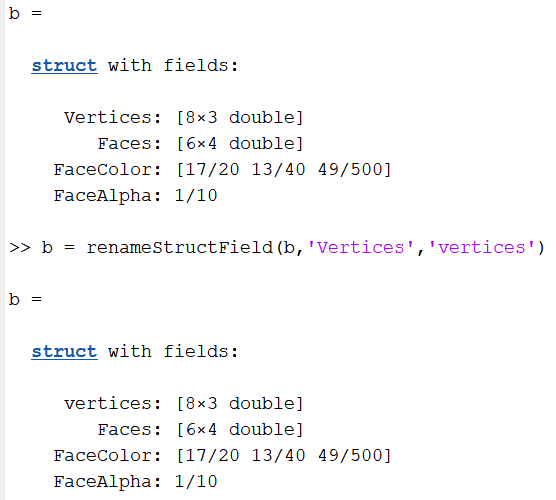
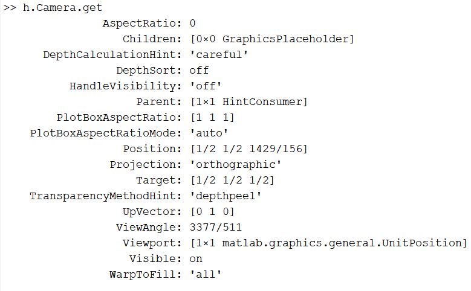

<!-- omit in toc -->
# Undocumented useful Matlab functions

This document consists of undocumented Matlab functions that can be useful in some scenarios.

- [Structs](#structs)
  - [renameStructField](#renamestructfield)
- [Axis](#axis)
  - [Axes Camera](#axes-camera)

## Structs

Functions related to structs

### renameStructField

Renames the given structure field. Needs 3 inputs, the structure, old name and new name.



## Axis

### Axes Camera

Get

```Matlab
h = axes;
h.Camera.get;
```
